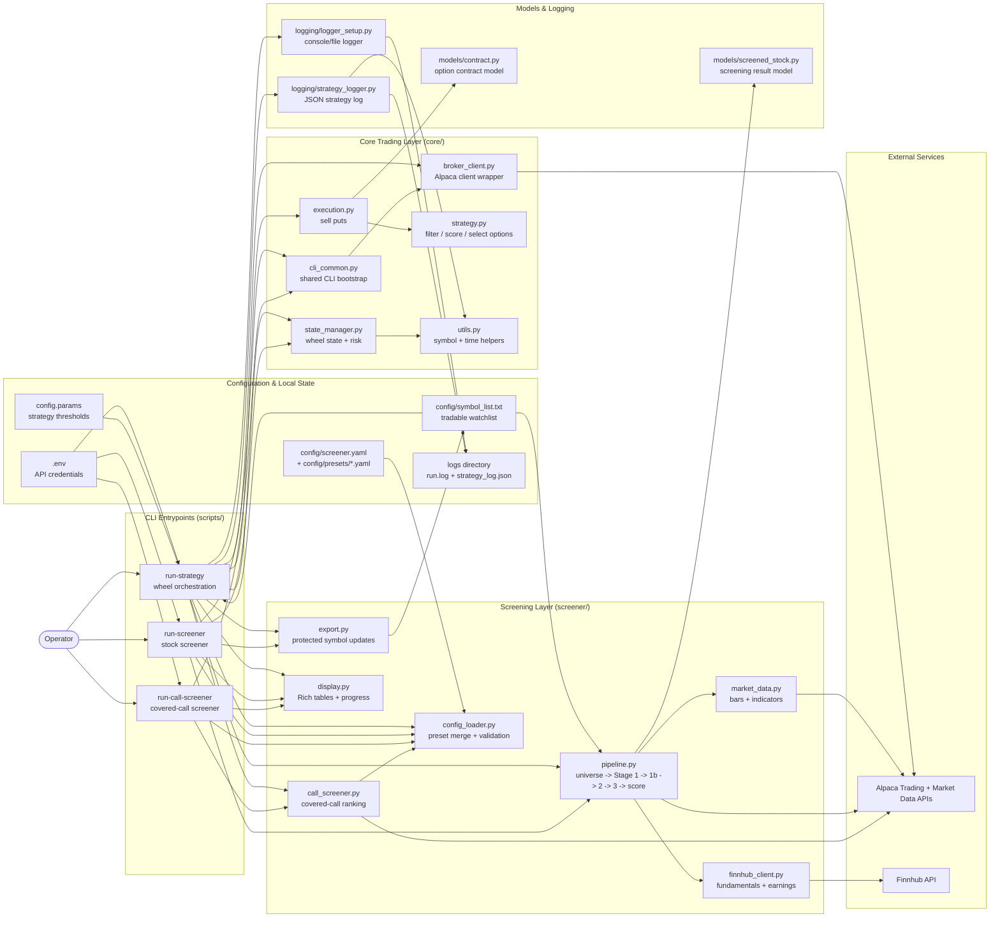

# Current Architecture

This project is a Python CLI application with three entrypoints built around two related workflows:

- Wheel strategy execution and order placement
- Stock and covered-call screening

The diagram below reflects the current code in `scripts/`, `core/`, `screener/`, `models/`, `config/`, and `logging/`.

## Runtime Flows

1. `run-strategy` loads credentials and thresholds, optionally runs the screener pipeline, reconciles current portfolio state, sells covered calls for assigned shares, then scans and sells puts through the execution layer.
2. `run-screener` builds a broker client, loads screener config, runs the multi-stage screening pipeline, renders Rich output, and optionally writes a position-safe `config/symbol_list.txt`.
3. `run-call-screener` reuses the screener config and Alpaca clients to rank covered calls for a single underlying and cost basis.

## Key Design Points

- Alpaca is the primary execution and market-data dependency.
- Finnhub is isolated behind `screener/finnhub_client.py` for fundamentals and earnings lookups.
- The screening pipeline is intentionally staged so cheap Alpaca-based filters run before slower Finnhub and options-chain checks.
- `run-strategy` is the integration point where screening, portfolio-state management, execution, and logging meet.
